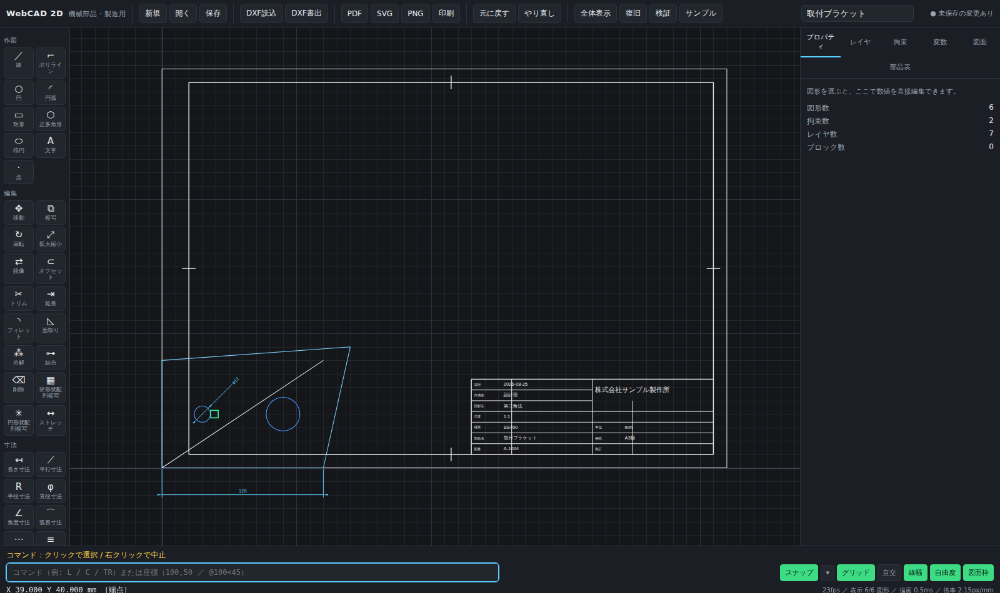

# WebCAD 2D — ブラウザ版 2D CAD（機械部品・製造用）

要件仕様書「ブラウザ版 2D CAD（機械部品・製造用）第1.0版」に基づく実装です。
インストール不要、ブラウザだけで動きます。実行時の外部ライブラリはゼロ（依存はビルド時のみ）。



## すぐ動かす

```bash
npm install       # 初回のみ（TypeScript と esbuild を取得）
npm run dev       # http://localhost:5173/ が開発サーバ
```

ブラウザで `http://localhost:5173/` を開き、上部の **「サンプル」** ボタンを押すと
サンプル図面（取付ブラケット）が読み込まれます。

### 配布用の単一ファイルを作る

```bash
npm run build:single    # dist/webcad.html が1ファイルで完結（サーバ不要・ダブルクリックで開ける）
```

取引先へは `dist/webcad.html` を送るだけで使えます（約200KB）。
サーバも通信も不要で、ファイルをダブルクリックすればブラウザで開き、そのまま作図・DXF書き出しまでできます。

### 検収テストを走らせる

```bash
npm test        # 仕様 第11章の検収チェックリストを自動実行（39項目）
npm run typecheck
```

画面右上の **「検証」** ボタンでも同じ検査がその場で走ります。

## 操作のしかた

| したいこと | 操作 |
|---|---|
| コマンド実行 | 左のツールをクリック、または下の入力欄に `L`（線）`C`（円）`TR`（トリム）`O`（オフセット）`M`（移動）など |
| 正確な座標入力 | `100,50`（絶対）／`@100,0`（相対）／`@100<45`（極座標）／数値だけ（カーソル方向にその長さ） |
| 計算式での入力 | `穴径*3` のように、変数タブで定義した変数と式が使えます |
| 吸着（スナップ） | 端点□／交点×／中心○／中点△ などに自動吸着。下部の「スナップ ▾」で種類ごとにON/OFF |
| 直交モード | Shift 押しっぱなし、または F8 |
| 選択 | クリック／左→右のドラッグ＝完全に含むもの／右→左＝触れているもの全部 |
| 図形の編集 | 選択後、青い□（グリップ）をドラッグ。右パネルで数値を直接入力しても変わります |
| 元に戻す | Ctrl+Z（300手順まで）／やり直し Ctrl+Y |
| 全体表示 | Ctrl+0 |
| ズーム・パン | ホイールでズーム、中ボタン（またはAlt+ドラッグ）で移動 |

ショートカットは AutoCAD 互換です（L / C / A / REC / TR / EX / O / M / CO / RO / MI / F / CHA / X / J / B / I …）。

## 仕様書との対応

実装状況の一覧は **[docs/仕様対応表.md](docs/仕様対応表.md)** にあります。
未実装項目とその理由（サーバ側機能・有償ライセンスが要るもの）も同じ表に明記しています。

## 精度について（仕様 第2章）

- 座標は内部で **1マイクロメートル（1/1000 mm）を「1」とする整数**として保持します。小数は保存しません。
- 角度は **1/1,000,000 度を「1」とする整数**です。
- 交点計算など小数が必要な場面は倍精度で計算し、**保存する瞬間に必ず整数へ丸めます**（丸めは四捨五入・0.5は偶数側）。
- 一致判定の許容差は全機能で統一（点＝1µm、平行＝0.000001度、閉図形＝1µm）。
- `.xcad` 保存時に「座標に小数が混ざっていないか」を毎回検査し、混入していれば保存を中止します。

実測値（このリポジトリの `npm test` と `scripts/` の計測スクリプトで再現できます）：

| 検収項目 | 要件 | 実測 |
|---|---|---|
| 100mmの線を10本つないだ合計 | ちょうど 1000.000mm | 1000.000mm（内部値 1000000µm、誤差ゼロ） |
| 12345.678mm 移動して戻す | 完全一致 | 完全一致（差 0µm） |
| 90度回転を4回 | 完全に元通り | 完全一致（差 0µm） |
| DXF書出→読込を5回 | 座標不変 | R12・2013 とも完全一致 |
| 図形5万個の表示 | 60fps | 全体表示 2.2ms/フレーム（約450fps）、拡大時 7.9ms（約125fps） |
| 5MBのDXF読み込み | 3秒以内 | 6.5MB を 0.41秒（読込＋索引構築） |
| 拘束200個の再計算 | 0.1秒以内 | 176個で 13ms、450個で 4.3ms〜 |
| Undo | 100手順以上 | 300手順 |
| 自動保存 | 30秒ごと・復旧可 | 30秒ごとにIndexedDBへ、履歴30世代 |

## ファイル構成

```
src/
  core/      units.ts  … 整数µm・整数µdegの単位系と丸め（仕様 第2章の心臓部）
             geom.ts   … 交点・接線・変換などの幾何計算
  model/     types.ts  … 図形・レイヤ・ブロック・拘束・図面のデータ定義（第3章）
             doc.ts    … 図形の幾何アクセサ・空間索引（R-tree相当）
             store.ts  … 変更の単一窓口。差分方式のUndo/Redo
             expr.ts   … 変数と計算式（第4章 4-3）
  solver/    solver.ts … 拘束ソルバ（第4章）ガウス・ニュートン＋LM減衰、自由度・過拘束判定
  snap/      snap.ts   … スナップ（第5章 5-2）8種類・優先順位・10px固定
  ops/       edit.ts   … トリム・延長・オフセット・フィレット・面取り・結合・配列複写
  render/    painter.ts… 画面／PDF／SVG で共用する描画の抽象
             canvas.ts … Canvas2D描画（グリッド・選択・自由度の色分け）
             dim.ts    … 寸法の作図（JIS B 0001準拠）
             annot.ts  … 幾何公差(GD&T)・表面粗さ・引出線
  io/        dxfwrite.ts / dxfread.ts … DXF R12・2013（第7章）
             pdf.ts / svg.ts / xcad.ts … PDF・SVG・独自保存形式
  sheet/     frame.ts  … 図面枠・表題欄・部品表(BOM)
  app/       app.ts    … 状態・入力・描画ループ・コマンド実行
             commands.ts … 全コマンド定義
             ui.ts     … パネル類
             selftest.ts … 検収チェックリストの自動実行
tests/       検収テスト・機能テスト（node --test）
docs/samples/ サンプル図面の DXF / SVG / PDF / xcad 出力例
```

## 開発用スクリプト

| コマンド | 内容 |
|---|---|
| `npm run dev` | 開発サーバ（保存すると自動で再ビルド） |
| `npm run build` | `dist/` に本番ビルド |
| `npm run build:single` | 単一HTMLファイル `dist/webcad.html` を生成 |
| `npm test` | 検収テスト＋機能テスト（39項目） |
| `npm run typecheck` | 型検査 |
| `npm run samples` | `docs/samples/` にDXF・SVG・PDF・xcadの出力例を生成し、PDF構造を検査 |
| `npm run perf` | DXF読込・拘束ソルバの性能計測 |
| `npm run smoke` | 実ブラウザでの操作テスト（先に `npm i -D playwright` が必要） |
| `node scripts/singlecheck.mjs` | 単一ファイル版が `file://` だけで動くことの確認 |

## 公開URL（Artifact版）

`npm run build:artifact` で claude.ai の Artifact 用HTML（`dist/webcad.artifact.html`）を生成できます。
Artifact上ではページからの直接ダウンロードが制限されるため、
ホスト側の保存機能（`claude.use('downloads')`）経由で保存します。
DXFは拡張子が許可されていないため `.dxf.txt` として保存され、その旨を画面で案内します。
拡張子の制限なくDXFを扱いたい場合は、通常のWebサーバ（Vercel等）へ配置するか、
`dist/webcad.html`（単一ファイル版）を配布してください。
